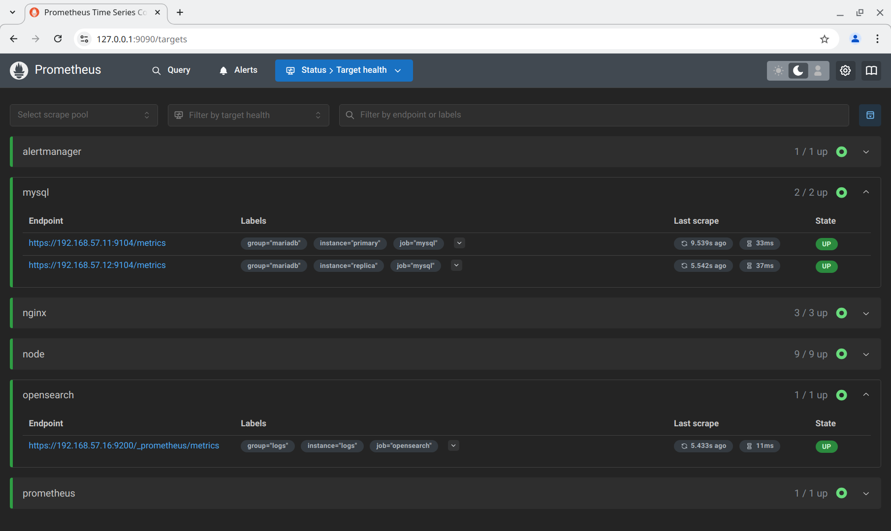

# Реализация отказоустойчивой системы управления ИТ-инфраструктурой на базе GLPI

## Задание

**Web**-проект с развертыванием нескольких виртуальных машин должен отвечать следующим требованиям:

- включен **https**;
- основная инфраструктура в **DMZ** зоне;
- **firewall** на входе;
- сбор метрик и настроенный алертинг;
- везде включен **SELinux**;
- организован централизованный сбор логов;
- организован **backup**.

## Схема


Проект состоит из 9 виртуальных машин:

- **primary** - основная база данных (**MariaDB**) для **GLPI**.
- **replica** - реплика **primary**, также используется **GLPI** для **read-only** запросов и в случае недоступности **primary** (в режим только чтение).
- **nfs** - общее хранилище файлов файлов и сессий для **GLPI**, доступное по **NFS**. На сервер настроено ограничение доступа к службе по **IP** адресам.
- **backend1** и **backend2** - экземляры **GLPI** (**angie**, **php-fpm**, **GLPI**).
- **frontend** - обратный прокси, проксирует запросы к **backend**, приходящие на адрес [glpi.otus.abegorov.ru](https://glpi.otus.abegorov.ru) из внешней сети **192.168.56.0/24** во внутреннюю сеть **192.168.57.0/24**.
- **logs** - узел для хранения логов (**opensearch**, **opensearch-dashboards**), для сбора логов на всех узлах настроен **rsyslog**, который отправляет логи в **opensearch**, логи разбиваются на поля с помощью модулей **mmjsonparse** и **mmnormalize**.
- **monitor** - узел мониторинга с **grafana**, **prometheus** и **alertmanager**. Метрики собираются с установленных на узлах **node_exporter**, **mysqld_exporter**, **prometheus-exporter-plugin-for-opensearch**, **angie-module-vts**, **prometheus**, **alertmanager**. В **grafana** настроены соответствующие **dashboard'ы**.
- **backup** - производит резервное копирование и хранение резервных копий. Резервная копия базы данных производится с узла **primary** (на случай поломки репликации), для этого служба в полночь подключается к узлу по **ssh** (сам узел не имеет доступ на **backup** сервер). Для резервного копирование файлов в **NFS** хранилище используется **restic** (хранилище подключено к серверу резервных копий).

Всё замодействие между службами (включая сбор логов, метрик, подключение к базам данным) происходит с аутентификацией и использованием протокола **TLS**. **SELinux** оставлен включённым на всех узлах.

## Реализация

Задание сделано на **rockylinux/9** версии **v9.5-20241118.0**. Для автоматизации процесса написан **Ansible Playbook** [playbook.yml](playbook.yml) который последовательно запускает следующие роли:

- **alertmanager** - устанавливает и настраивает **alertmanager** для отправки алертов на узле **monitor**. Токен бота берётся из файла `secrets/telegram_token.txt` репозитория (его необходимо создать).
- **angie** - устанавливает и настраивает **angie** на узлах **frontend**, **backend1**, **backend2**. Также настраивает отправку логов в **rsyslog** в формате **json**. Для отдачи метрик **Prometheus** настраивается и используется **angie-module-vts**.
- **backup_mariadb** - настраивает ежедневное резервное копирование базы данных (через **systemd timer** в полночь) на узле **backup** в `/srv/backup/mariadb/primary`. Резервное копирование делается в виде одного файла в формате **xbstream**, сжатого с помощью **zstd**.
- **backup_start** - производит резервное копирование базы данных **mariadb** и файлов на **nfs**, запуская сервисы **backup-mariadb-primary** и **restic-backup-nfs-glpi** на узле **backup**.
- **epel_release** - добавляет репозиторий **Extra Packages for Enterprise Linux (EPEL)** на всех узлах.
- **firewalld** - настраивает **firewalld** на всех узлах (добавляет и удаляет порты, службы и интерфейсы в нужну зону).
- **glpi** - устанавливает **GLPI** на узлах **backend1** и **backend2**.
- **glpi_agent** - устанавливает на всех узлах агент инвентаризации **GLPI**.
- **grafana** - устанавливает **grafana** на узле **monitor**.
- **grafana_dashboards** - добавляет **dashboard**'ы для **grafana** в директорию `/var/lib/grafana/dashboards/provisioned` на узле **monitor**.
- **mariadb_config** - настраивает конфигурационные файлы **mariadb**, в частности генерит `/etc/my.cnf.d/server.cnf` на узлах **primary** и **replica**.
- **mariadb_databases** - создаёт базы данных на узле **primary**.
- **mariadb_install** - устанавливает **mariadb** на узлах **primary** и **replica**.
- **mariadb_replica** - настраивает репликацию на узле **replica** (с **primary**). Используется **GTID** и **gtid_strict_mode**.
- **mariadb_restore** - восстанавливает базу данных на **primary** с **replica** или наоборот.
- **mariadb_status** - получает состояние сервиса **mariadb** на **primary** и **replica** (она используется **mariadb_restore** для определения на каких и с каких узлов начинать восстановление).
- **mariadb_tls** - копирует на узлы **primary** с **replica** сертификаты **TLS** для настройки безопасного подключения к базе данных;
- **mariadb_users** - создаёт пользователей **mariadb** на узле **primary**;
- **mysqld_exporter** - устанавливает и настраивает **Prometheus MariaDB Exporter** на узлах **primary** и **replica**.
- **nfs_automount** - настраивает автоматическое монтирование общей папки **NFS** на узлах **backend1**, **backend2** (в `/var/lib/glpi`) и **backup** (в `/mnt/nfs/glpi`).
- **nfs_server** - настраивает **NFS** сервер на узле **nfs**. Расшаривает директорию `/export/glpi`.
- **nmcli** - настраивает сеть на всех узлах (**IP** адреса и добавляет **wan** интерфейс на **frontend** в зону **DMZ**).
- **node_exporter** - устанавливает и настраивает **Prometheus Node Exporter** на всех узлах.
- **opensearch** - устанавливает **Opensearch** (аналог **Elasticsearch**) на узле **logs**. Производит настройку пользователей, ролей и их сопоставлений. Устанавливает **prometheus-exporter-plugin-for-opensearch**.
- **opensearch_dashboards** - устанавливает **Opensearch Dashboards** (аналог **Kibana**) на узле **logs**.
- **opensearch_patterns** - настраивает шаблоны **audit-\***, **glpi-\***, **nginx-access-\***, **nginx-error-\*** и **syslog-\*** для индексов в **Opensearch Dashboards** на узле **logs**.
- **prometheus** - устанавливает и настраивает **prometheus** на узле **monitor**. Настраиваются задания на сбор метрик, алерты и интеграция с **alertmanager**.
- **restic_backup** - настраивает ежедневное резервное копирование файлов с помощью **restic** в общей **NFS** директории (через **systemd timer** в полночь) на узле **backup** в `/srv/backup/restic`.
- **restic_repo** - инициализирует репозиторий **restic** на узле **backup** в `/srv/backup/restic`.
- **rsyslog** - настраивает сбор логов **angie**, **auditd**, **glpi**, **systemd**, **syslog**, их парсинг и отправку в **opensearch**.
- **ssh_authorized_keys** - разрешает пользователю **root** на узле **backup** подключаться по **ssh** к узлам **primary** и **replica**.
- **ssh_key** - генерит **ssh** ключ для пользователя **root** на узле **backup**.
- **ssh_known_hosts** - добавляет узлы **primary** и **replica** в `/root/.ssh/known_hosts` на узле **backup**.
- **tls_gen** - генерит сертификат **CA** и с его помощью сертификаты для всех узлов проекта, сохраняя их в директории `secrets/certs` репозитория.
- **trust_ca** - добавляет сертификат **CA**, используемый для генерации сертификатов узлов в **tls_gen** в доверенные на всех узлах.

Настройки для указанных ролей есть файлах [group_vars](group_vars/) и [host_vars](host_vars/). Все настройки роли начинаются префикса, соответствующему имени роли. Настройки для всех узлов представлены в файлах [all.yml](group_vars/all.yml), настройки для **backend1** и **backend2** представлены в [backend.yml](group_vars/backend.yml), настройки для **primary** и **replica** представлены в [mariadb.yml](group_vars/mariadb.yml).

Настройки для отдельных узлов можно найти в файлах [backend1.yml](host_vars/backend1.yml), [backend2.yml](host_vars/backend2.yml), [backup.yml](host_vars/backup.yml), [frontend.yml](host_vars/frontend.yml), [logs.yml](host_vars/logs.yml), [monitor.yml](host_vars/monitor.yml), [nfs.yml](host_vars/nfs.yml), [primary.yml](host_vars/primary.yml) и [replica.yml](host_vars/replica.yml). Также часть настроек присутствует в директории **defaults** ролей.

Все секреты (за исключением `secrets/telegram_token.txt`) автоматически генерятся в директории `secrets` репозитория.

## Запуск

Необходимо скачать **VagrantBox** для **rockylinux/9** версии **v9.5-20241118.0** и добавить его в **Vagrant** под именем **rockylinux/9/v9.5-20241118.0**. Сделать это можно командами:

```shell
curl -OL https://dl.rockylinux.org/pub/rocky/9.5/images/x86_64/Rocky-9-Vagrant-Vbox-9.5-20241118.0.x86_64.box
vagrant box add Rocky-9-Vagrant-Vbox-9.5-20241118.0.x86_64.box --name "rockylinux/9/v9.5-20241118.0"
rm Rocky-9-Vagrant-Vbox-9.5-20241118.0.x86_64.box
```

Для того, чтобы **vagrant 2.3.7** работал с **VirtualBox 7.1.0** необходимо добавить эту версию в **driver_map** в файле **/usr/share/vagrant/gems/gems/vagrant-2.3.7/plugins/providers/virtualbox/driver/meta.rb**:

```ruby
          driver_map   = {
            "4.0" => Version_4_0,
            "4.1" => Version_4_1,
            "4.2" => Version_4_2,
            "4.3" => Version_4_3,
            "5.0" => Version_5_0,
            "5.1" => Version_5_1,
            "5.2" => Version_5_2,
            "6.0" => Version_6_0,
            "6.1" => Version_6_1,
            "7.0" => Version_7_0,
            "7.1" => Version_7_0,
          }
```

После этого нужно сделать **vagrant up**.

Протестировано в **OpenSUSE Tumbleweed**:

- **Vagrant 2.3.7**
- **VirtualBox 7.1.4_SUSE r165100**
- **Ansible 2.18.1**
- **Python 3.11.11**
- **Jinja2 3.1.4**

## Проверка

Проверим зоны **firewalld** на **frontend**. Видно, что интерфейс **eth2** находится в **dmz** зоне и на нём доступны только порт **http** и **https**:

```text
❯ vagrant ssh frontend -c 'sudo firewall-cmd --list-all --zone=public'
public (active)
  target: default
  icmp-block-inversion: no
  interfaces: eth0 eth1
  sources:
  services: prometheus-node-exporter ssh
  ports: 62354/tcp 9913/tcp
  protocols:
  forward: yes
  masquerade: no
  forward-ports:
  source-ports:
  icmp-blocks:
  rich rules:

❯ vagrant ssh frontend -c 'sudo firewall-cmd --list-all --zone=dmz'
dmz (active)
  target: default
  icmp-block-inversion: no
  interfaces: eth2
  sources:
  services: http https
  ports:
  protocols:
  forward: yes
  masquerade: no
  forward-ports:
  source-ports:
  icmp-blocks:
  rich rules:
```

Перейдём по ссылке [http://glpi.otus.abegorov.ru](http://glpi.otus.abegorov.ru). **angie** перенаправляет на **https**:


Проверим, что настроен сбор метрик:



Проверим, что настроен алертинг в **Prometheus**:


Проверим, что настроен алертинг в **Alertmanager**:


Проверим, что приходят алерты в **Telegram**:


Проверим, что везде включён **SELinux**:

```text
❯ for h in backend1 backend2 backup frontend logs monitor nfs primary replica; do vagrant ssh $h -c 'echo $(cat /etc/hostname): $(getenforce)'; done
backend1.internal: Enforcing
backend2.internal: Enforcing
backup.internal: Enforcing
frontend.internal: Enforcing
logs.internal: Enforcing
monitor.internal: Enforcing
nfs.internal: Enforcing
primary.internal: Enforcing
replica.internal: Enforcing
```

Проверим централизованный сбор логов:


Проверим работу **grafana**:


Проверим **backup**:

```text
❯ vagrant ssh backup -c 'sudo ls -la /srv/backup/mariadb/primary'
total 11108
drwxr-xr-x. 2 root root     120 Jan 13 21:07 .
drwxr-xr-x. 3 root root      21 Jan 13 19:02 ..
-rw-r--r--. 1 root root 3234589 Jan 13 19:03 2025-01-13T19:02:22+00:00.zstd
-rw-r--r--. 1 root root 3256929 Jan 13 19:09 2025-01-13T19:08:19+00:00.zstd
-rw-r--r--. 1 root root 4876966 Jan 13 21:08 2025-01-13T21:07:20+00:00.zstd

❯ vagrant ssh backup -c 'sudo restic -r /srv/backup/restic -p /etc/restic/nfs-glpi snapshots'
repository ca9f252c opened successfully, password is correct
ID        Time                 Host             Tags        Paths
-------------------------------------------------------------------------
6f7130e3  2025-01-13 19:03:12  backup.internal              /mnt/nfs/glpi
e8497014  2025-01-13 19:09:04  backup.internal              /mnt/nfs/glpi
fef5a542  2025-01-13 21:08:11  backup.internal              /mnt/nfs/glpi
-------------------------------------------------------------------------
3 snapshots

```

Как видно, все задания выполнены.
